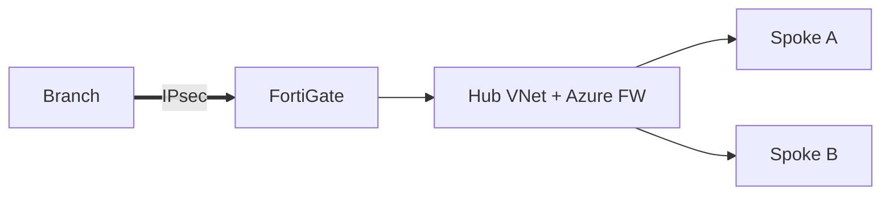

# Fortinet Azure SD-WAN over IPsec
Reference hub-spoke design with redundant IPsec tunnels to FortiGate.

## Topology


## Example Tunnel
```json
{
  "tunnelName": "branch-a",
  "peerIp": "203.0.113.10",
  "pskSecretRef": "kv://sdwan/psk-branch-a",
  "ikeVersion": 2,
  "dpd": true
}
```

## Outcome
- Dual tunnel up; failover **~3–5s** via SLA probe
